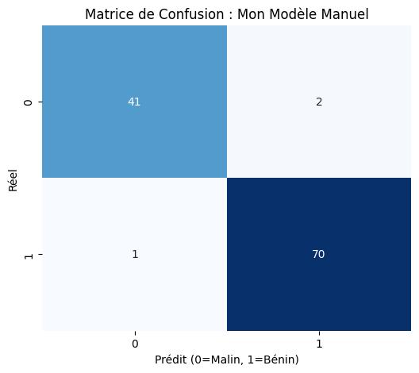

# Breast Cancer Diagnosis: Neural Network Built from Scratch

## Project Overview
As part of my preparation for the **M.Sc. in Data Science at HEC Montréal**, I built a logistic regression neural network entirely from scratch.

**The Goal:** To demystify the "black box" of AI by manually implementing the mathematics behind Deep Learning (Forward/Backward Propagation, Gradient Descent) using only **NumPy**. I then benchmarked this custom model against the industry standard (**Scikit-Learn**).

## Key Results
My manual implementation achieved identical performance to the optimized library, validating the mathematical logic.

| Model | Accuracy | Implementation |
| :--- | :--- | :--- |
| **My Custom Model** | **97.37%** | Raw NumPy & Math |
| Scikit-Learn (Baseline) | **97.37%** | LogisticRegression |

### Clinical Error Analysis (Confusion Matrix)
Accuracy is not enough in medical diagnostics. I analyzed *where* the model failed using the Confusion Matrix:

* **Correct Diagnoses (111/114):** The model correctly identified 41 malignant tumors and 70 benign cases.
* **False Positives (1 case):** One healthy patient was incorrectly flagged (Type I Error). This leads to unnecessary stress/biopsy but is not life-threatening.
* **False Negatives (2 cases):** Two malignant tumors were classified as benign (Type II Error). In a real-world deployment, the sensitivity threshold would need adjustment to capture these critical cases, even at the cost of more false alarms.

## Technical Challenges & Solutions

### 1. The Scaling Problem
During Exploratory Data Analysis (EDA), I observed massive scale disparities:
* *Mean Area:* ~650 (Range: 143 - 2501)
* *Mean Smoothness:* ~0.096 (Range: 0.05 - 0.16)
**Solution:** Implemented `StandardScaler` to normalize features (Z-score normalization). Without this, the gradient descent failed to converge as the "Area" feature dominated the weight updates.

### 2. Dimension Mismatch
The raw dataset shape was `(569, 30)`. My neural network architecture required features to be row-based for matrix multiplication.
**Solution:** Applied matrix transposition to reshape inputs to `(30, 455)` for the training phase.

## Tech Stack
* **Core Logic:** Python, NumPy (Linear Algebra, Calculus)
* **Data Processing:** Pandas, Scikit-Learn (Scaling/Split only)
* **Visualization:** Matplotlib, Seaborn

## 📚 Credits & Inspiration
The neural network architecture is based on the logic learned in **Andrew Ng's** *Neural Networks and Deep Learning* course (Coursera). I adapted the algorithms to work with the real-world **Wisconsin Breast Cancer Dataset**.
